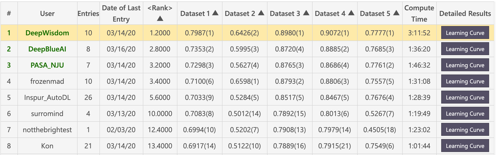
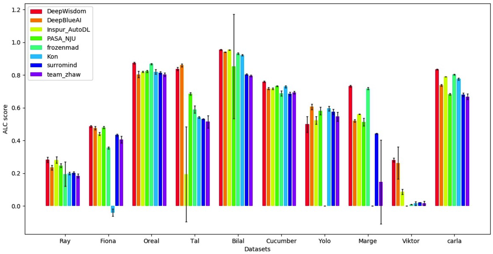

[](https://github.com/HazzaCheng/AutoDL2019/blob/master/LICENSE)

# AutoDL2019

## Introduction

3rd solution for [AutoDL 2019](https://autodl.chalearn.org/neurips2019). AutoDL challenge is the final challenge in [2019 AutoDL challenges series](https://autodl.chalearn.org/), part of [NeurIPS 2019 competition program](https://neurips.cc/Conferences/2019/CallForCompetitions). The datasets are from all the different modalities of the previous challenges in the series: image, video, speech, text, tabular. Competition rules can be found at [AutoDL Competition](https://autodl.lri.fr/competitions/162).

## Results

- Feedback-phase leaderboard


- Final-phase leaderboard


## Usage

Run

```
python run_local_test.py -dataset_dir=./AutoDL_sample_data/DEMO -code_dir=./AutoDL_sample_code_submission
```

You can change the argument `dataset_dir` to other datasets, and change the argument `code_dir` to the directory containing this code (`model.py`).

## Contributor

- Feng Cheng, NJU, [hazzacheng@gmail.com](mailto:hazzacheng@gmail.com)
- Zhuoer Xu, NJU, [xuzhuoer.rex@gmail.com](mailto:xuzhuoer.rex@gmail.com)
- Wenjie Wang, NJU, [wjwangpt@gmail.com](mailto:wjwangpt@gmail.com)
- Mengchuan Qiu, NJU, [mecthew.qiu@gmail.com](mailto:mecthew.qiu@gmail.com)
